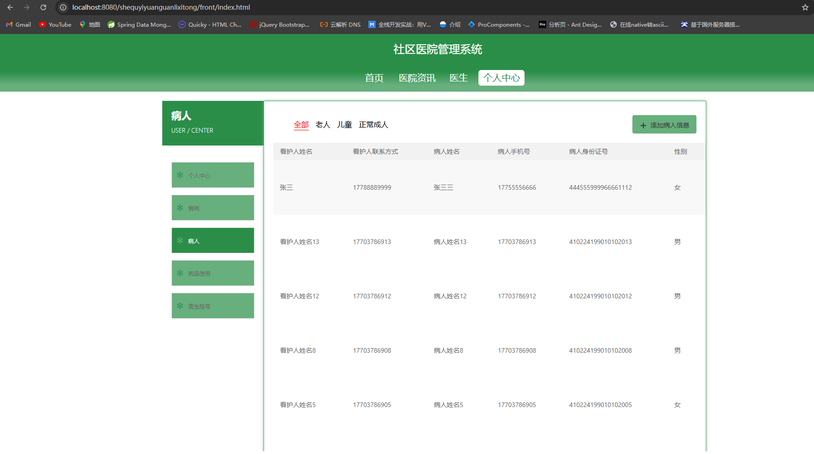

# 一、系统说明

基于springboot+vue+elementui开发的社区医院管理系统,系统功能齐全, 代码简洁易懂，适合小白学编程。

# 二、系统架构

######      前端：vue| elementui

######      后端：springboot | mybatis 

######      环境：jdk1.8+ | mysql8.0+ | maven

# 三、代码及数据库

# 四、相关功能介绍

#### 1).客户端

###### 1.登录

###### 2.注册

###### 3.首页

###### 4.医院资讯

###### 5.医生

###### 6.个人中心

###### 7.个人中心->病例

包含:缴费功能

###### 8.个人中心->病人信息

包含:添加病人信息

###### 9.个人中心->药品使用

###### 10.个人中心->医生挂号

#### 2).管理端

###### 1.登录

###### 2.个人中心->修改密码

###### 3.管理员管理

包含:删除、修改、新增、详情功能

###### 4.基础数据管理

包含:病人类型管理、医院资讯类型管理、科室管理、药品类型管理、职位管理

###### 5.留言板管理

包含:修改、删除、详情、新增功能

###### 6.医院资讯管理

包含:修改、删除、详情、新增功能

###### 7.药品管理

包含:新增、修改、详情、删除功能

###### 8.药品入库管理

包含:新增、修改、详情、删除功能

###### 9.药品使用管理

包含:新增、修改、详情、删除功能

###### 10.医生管理

包含:修改、详情、删除、新增、重置密码功能

###### 11.医生咨询管理

包含:回复功能

###### 12.病人管理

包含:新增、修改、删除、详情功能

###### 13.病人管理->病例管理

包含:新增、修改、删除、详情功能

###### 14.医生挂号管理

包含:新增、修改、删除、详情功能

###### 15.用户管理

包含:修改、详情、删除、新增、重置密码功能

###### 16.轮播图管理

包含:修改、详情、删除、新增功能

